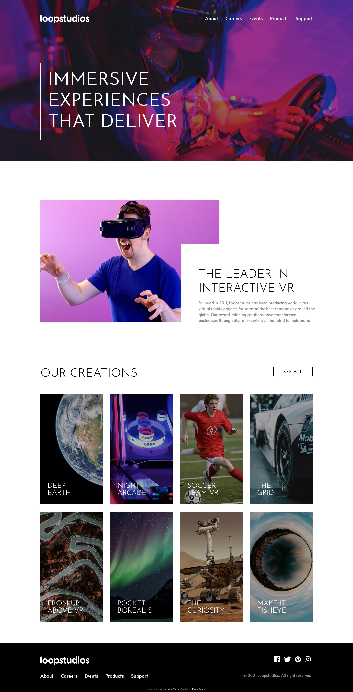

# Frontend Mentor - Loopstudios landing page solution

This is a solution to the [Loopstudios landing page challenge on Frontend Mentor](https://www.frontendmentor.io/challenges/loopstudios-landing-page-N88J5Onjw). Frontend Mentor challenges help you improve your coding skills by building realistic projects.

## Table of contents

- [Overview](#overview)
  - [Screenshot](#screenshot)
  - [Links](#links)
- [My process](#my-process)
  - [Built with](#built-with)
  - [What I learned](#what-i-learned)
- [Author](#author)

## Overview

### Screenshot

### Links

- Live Site URL: [Loopstudios landing page](https://pawel-gnat.github.io/Frontend-Mentor-Loopstudios-landing-page/)

## My process

Below is my thinking process of Java Script code:

After I selected my links and menu bar items with query selector I just toggled active/display classes on menu button or link click.

### Built with

- Semantic HTML5 markup
- CSS custom properties
- Flexbox
- Grid
- Mobile-first workflow
- JavaScript

### What I learned

I did this challenge in 14,5 hours. My biggest fail is setting general font-size in body and not in the root/html declaration. I learned how to animate my hamburger menu view to start from the left side of the website. I also learned how to use a nice looking transform:scale on hover. Ah! and I'm happy with my smooth image-text transition (@media-queries) inside company section.

## Author

- Frontend Mentor - [@Pawel-Gnat](https://www.frontendmentor.io/profile/Pawel-Gnat)
